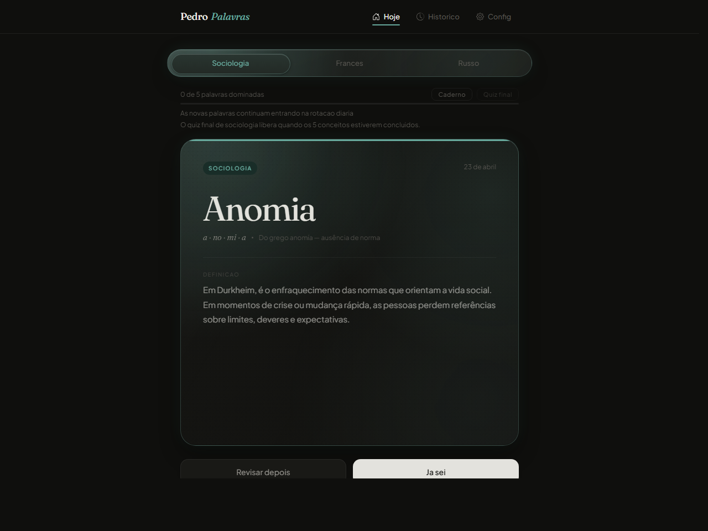

# PP Pedro Palavras



[Acessar o projeto online](https://pdrbala.github.io/pedro-palavras-PP/)

PP Pedro Palavras é um app de estudo diário feito para aprender palavras, conceitos e idiomas sem virar uma lista cansativa. A ideia é transformar revisão em um ritual curto: uma palavra por vez, progresso visível, categorias separadas e uma interface escura com cards em glassmorphism para deixar o estudo mais agradável.

## Objetivo

O projeto foi criado para ajudar na memorização de vocabulário e conceitos importantes com repetição diária, marcação de progresso e revisão simples. Em vez de jogar muitas informações na tela, o PP foca em blocos pequenos que cabem no caderno e são fáceis de revisar.

## Funcionalidades

- Categorias de estudo para Sociologia, Francês e Russo.
- Palavra ou conceito do dia com definição, exemplo, etimologia e autor quando fizer sentido.
- Streak por categoria para acompanhar consistência.
- Histórico de palavras vistas, palavras dominadas e itens para revisar.
- Modo caderno com explicações mais compactas para copiar e estudar.
- Quiz A-D com alternativas de múltipla escolha.
- Quiz final de Sociologia liberado apenas depois dos 5 conceitos do dia.
- Perguntas de Sociologia em ordem aleatória para evitar decorar sequência.
- Tema escuro por padrão, com visual glassmorphism, noise e cores por categoria.
- Reset all nas configurações para apagar histórico, streaks e progresso.

## Visual

A interface usa um visual escuro, minimalista e focado em leitura. Os cards principais têm efeito de vidro mais fechado, textura de dithering/noise e brilho sutil que muda conforme a categoria selecionada.

<h2 align="center">Tecnologias utilizadas:</h2>

<p align="center">
  
  
  
  
  
  
</p>

## Rodar localmente

```bash
npm install
npm run dev
```

## Build

```bash
npm run build
```
